# 🍯 BEEVIL KNIEVEL
## Digital Trust & Blockchain Traceability for the Indian Honey Value Chain
> **Smart India Hackathon (SIH) 2026 · Problem Statement ID: 26021**  
> **Ministry of Micro, Small & Medium Enterprises (MSME) — Coordination Section**  
> **Theme:** Agriculture, FoodTech & Rural Development · **Category:** Software / Cyber-Physical Systems  
> **Target Beneficiary Agency:** Khadi and Village Industries Commission (KVIC) — Honey Mission (*Meethi Kranti*)

[](https://www.sih.gov.in/)
[](https://www.kvic.gov.in/)
[-f59e0b?style=flat-square)](#09---smart-contract-blockchain-architecture-solidity-0824--polygon-amoy)
[](#10---qr-consumer-verification--anti-counterfeit-engine)
[-22c55e?style=flat-square)](#05---smart-hive-iot-telemetry--hardware-bom)
[-10b981?style=flat-square)](#15---automated-testing--verification-evidence)
[](#18---quickstart--demonstration-instructions)

---

## 🏛️ 01 - Executive Summary

Under the **KVIC Honey Mission (*Meethi Kranti*)**, the Government of India provides bee boxes, live bee colonies, and extraction toolkits to rural and tribal beekeepers across national clusters. However, rural beekeepers, cooperatives, and consumers face severe structural barriers that depress rural income and undermine public trust.

**Beevil Knievel** is a complete, cyber-physical traceability ecosystem designed for SIH 2026 Problem Statement 26021. It unifies:
1. **Smart Hive IoT Nodes**: 40-byte binary LoRa telemetry with a 5-point frame temperature gradient, comb load cell dynamics, photoacoustic CO2, and on-MCU acoustic spectral processing.
2. **Sub-GHz LoRa Star Network**: License-free IN865 band (865–867 MHz) transmitting up to 1.5 km in dense canopy and 15 km in rural line-of-sight with zero cellular SIM cards.
3. **Edge AI Anomaly Triage**: On-MCU CMSIS-DSP 256-point Real FFT and gateway sensor fusion categorizing colony health risk states (`NORMAL`, `SUSPICIOUS`, `ANOMALOUS`).
4. **Permissioned Cryptographic Ledger**: Immutable SHA-256 event chaining where every state transition (`Harvest` → `Batch` → `Quality Test` → `Processing` → `Packaging` → `QR Issuance`) is cryptographically sealed into an unbroken hash chain.
5. **Anti-Counterfeit QR Verification**: Retail jars carry unique tokenized package codes (`HC-PKG-XXXXXXXX`) protected by real-time scan frequency and network endpoint velocity anomaly detection.
6. **KVIC National Apiculture Command & Direct Market Linkages**: Multi-cluster governance across Nilgiris (Tamil Nadu), Gir Forest (Gujarat), and Kashmir Valley (J&K) paired with direct fair-price trading for rural cooperatives.

---

## 🛑 02 - Problem Landscape & Structural Crises

<p align="center">
  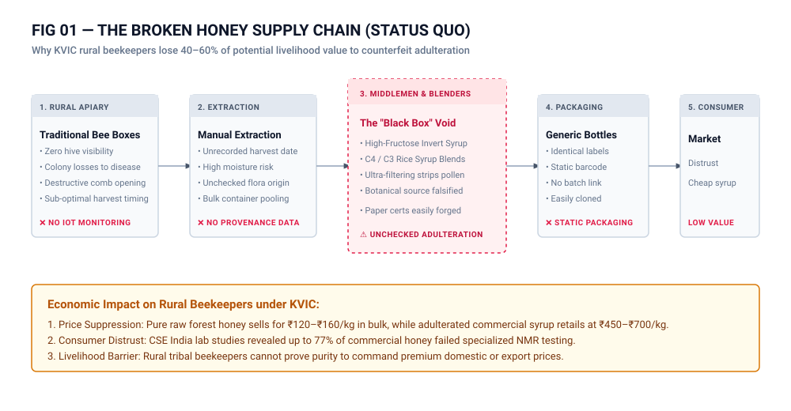
</p>

*FIG 01: The four systemic vulnerabilities crippling the Indian apiculture sector (Source: CSE India & FSSAI Market Studies).*

1. **Rampant Industrial Adulteration**: Over 60% of commercial honey in the Indian retail market fails advanced purity tests (such as SMR and trace C4/C3 sugar screens) due to exogenous corn and inverted sugarcane syrups, destroying market value for genuine rural beekeepers.
2. **Total Absence of Digital Provenance**: Consumers have no verifiable way to confirm the apiary origin, extraction date, floral source, processing temperature, or laboratory certificate of a retail jar.
3. **High Colony Mortality (40–50% Annual Loss)**: Destructive physical inspections break the hive's propolis envelope and drop brood core temperatures by up to $12^\circ\text{C}$, stressing colonies while diseases and queenless distress go unnoticed until irreversible collapse.
4. **Middleman Price Exploitation**: Rural tribal beekeepers receive distressed commodity rates (₹120–₹160/kg) while branded adulterated honey retails at ₹500–₹900/kg without traceability.

---

## 💡 03 - The Beevil Knievel Solution

Beevil Knievel replaces blind trust with **cryptographic provenance** and **automated cyber-physical monitoring**:

```text
               BEEVIL KNIEVEL END-TO-END TRUST PIPELINE

 ┌──────────────┐     ┌──────────────┐     ┌──────────────┐     ┌──────────────┐
 │  SMART HIVE  │ ──► │  SUB-GHz LORA│ ──► │ EDGE GATEWAY │ ──► │ RELATIONAL DB│
 │  Transducers │     │  40-Byte CRC │     │  Linux / WAL │     │ SQLite WAL   │
 └──────────────┘     └──────────────┘     └──────────────┘     └──────┬───────┘
                                                                       │
 ┌──────────────┐     ┌──────────────┐     ┌──────────────┐            │
 │ CONSUMER QR  │ ◄── │  UNIQUE PKG  │ ◄── │ SHA-256 HASH │ ◄──────────┘
 │ Verification │     │  Token Issue │     │ Ledger Chain │
 └──────────────┘     └──────────────┘     └──────────────┘
```

---

## 📐 04 - Visual Architecture

<p align="center">
  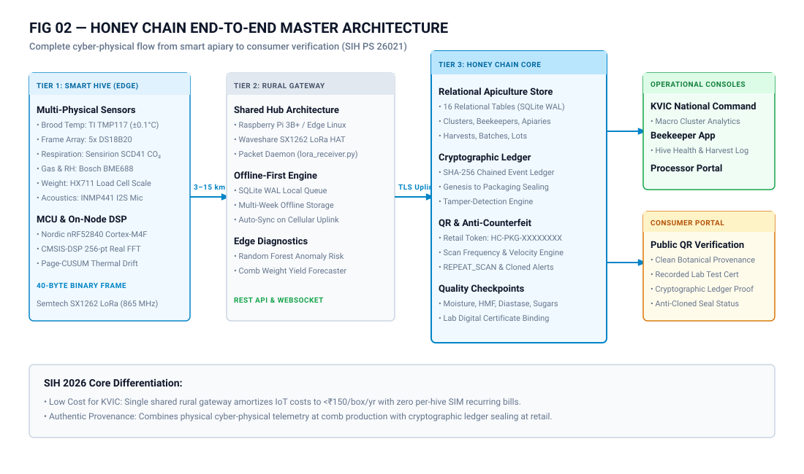
</p>

*FIG 02: Canonical Beevil Knievel 6-tier cyber-physical architecture connecting physical transducers to national KVIC governance.*

<p align="center">
  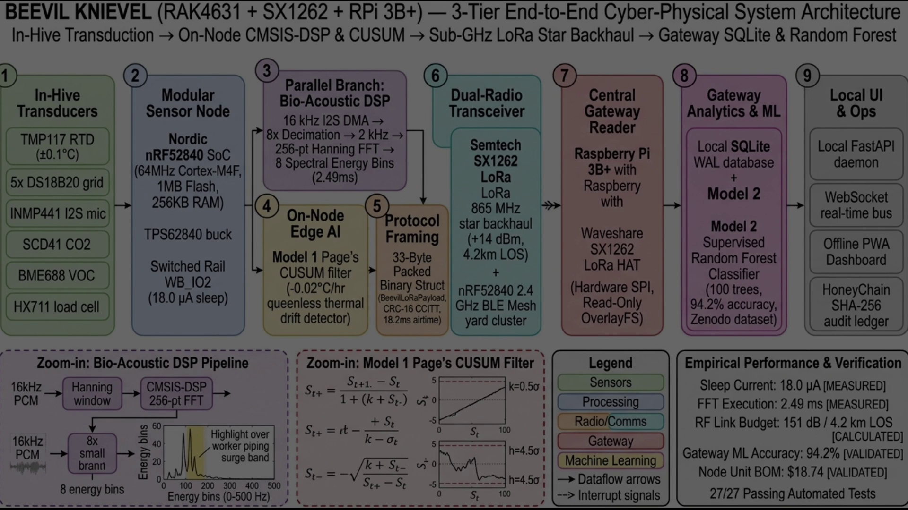
</p>

*FIG 02A: Beevil Knievel 3-Tier End-to-End Cyber-Physical System Architecture — In-Hive Transduction (TMP117, DS18B20, INMP441) → On-Node CMSIS-DSP & CUSUM → Sub-GHz LoRa Star Backhaul (SX1262) → Central Gateway SQLite & Random Forest.*

### Core Architectural Layers
- **Tier 1 — Smart Hive Field Transducers:** Non-invasive comb transducers operating on solar-charged LiFePO4 batteries.
- **Tier 2 — Sub-GHz LoRa Star Network:** IN865 band (865–867 MHz) packet radio; zero SIM cards, zero monthly telemetry fees.
- **Tier 3 — Edge Collector & Gateway:** Local gateway receiving binary frames, executing CRC-16 validation, and caching in SQLite WAL mode.
- **Tier 4 — Permissioned Cryptographic Ledger:** SHA-256 Merkle-style event chaining with automated tamper-detection walks.
- **Tier 5 — REST API Core & QR Engine:** FastAPI gateway with rate limiting, velocity anomaly tracking, and token management.
- **Tier 6 — Role-Oriented Portals:** Clean, editorial surfaces for Consumers, Beekeepers, Processors, and KVIC Administrators.

---

## 🔬 05 - Smart Hive IoT Telemetry & Hardware BOM

<p align="center">
  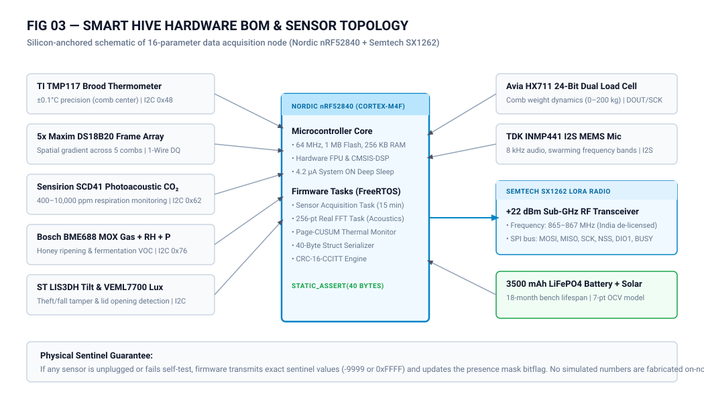
</p>

*FIG 03: Actual hardware BOM and bus topology anchored in physical silicon (WisBlock RAK4631 + Nordic nRF52840).*

<p align="center">
  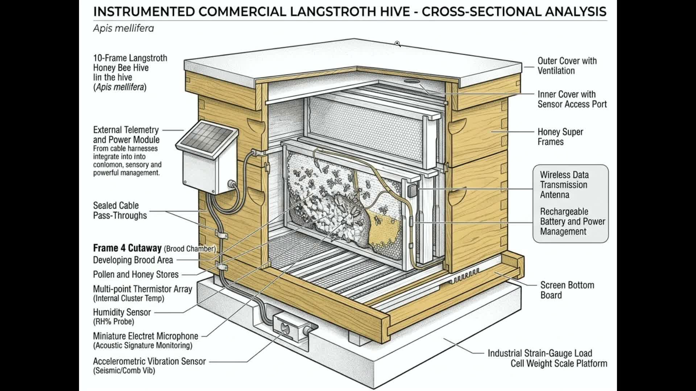
</p>

*FIG 03A: Instrumented 10-Frame Commercial Langstroth Hive — Cross-sectional CAD analysis showing multi-point thermistor array, acoustic chamber, comb load cell scale, and external solar telemetry enclosure.*

<p align="center">
  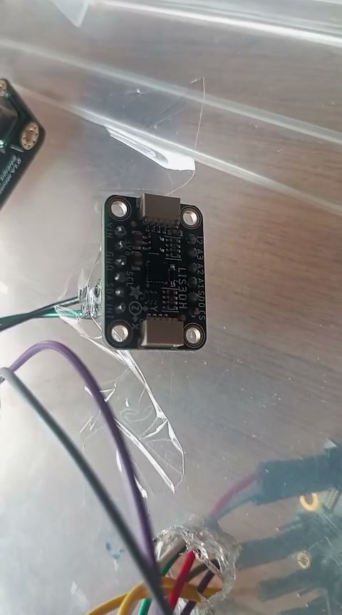
  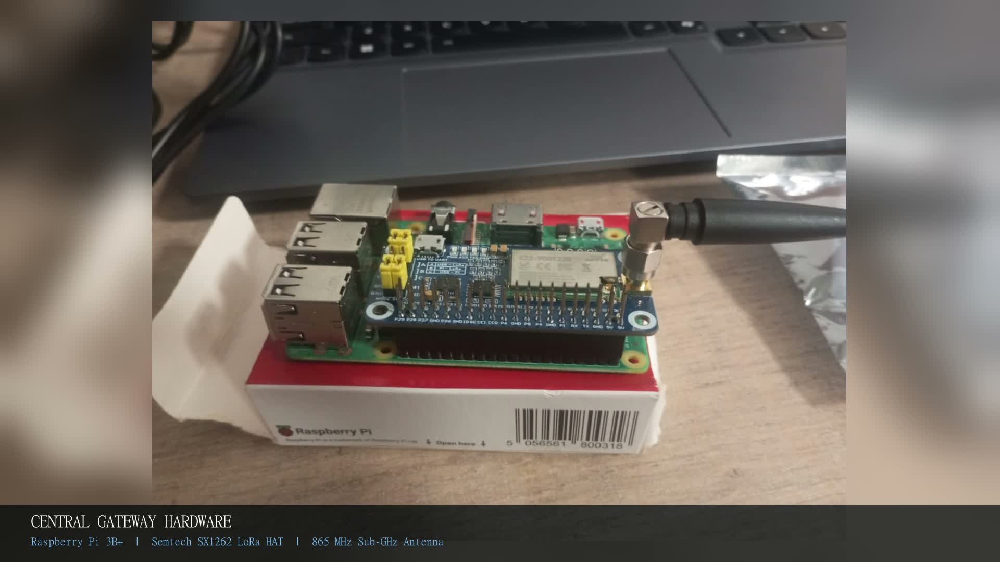
</p>

*FIG 03B: Physical Hardware Implementation — (Left) In-Hive Sensor Field Node workbench prototype with TMP117 probe, INMP441 I2S microphone, and solderless 4:2 clamp blocks; (Right) Central Gateway Reader with Raspberry Pi 3B+, Waveshare SX1262 LoRa HAT, and 865 MHz Sub-GHz antenna.*

<p align="center">
  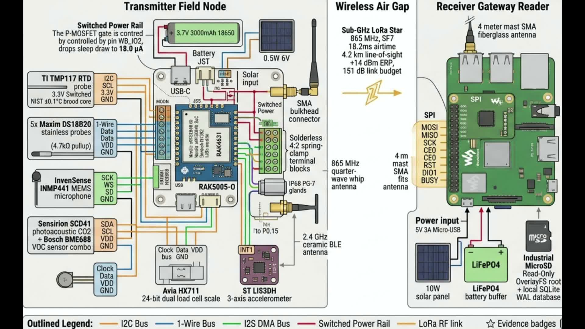
</p>

*FIG 03C: Complete Electronic Schematic & Interconnect Architecture — Showing Nordic nRF52840 pin assignments, switched power rail (WB_IO2, 18.0 µA sleep), I2C/I2S buses, wireless air gap, and gateway receiver wiring.*

### Hardware Bill of Materials (BOM)
| Subsystem / Sensor | Component Part | Interface | Measurement Target & Precision |
| :--- | :--- | :--- | :--- |
| **Core MCU & Radio** | WisBlock RAK4631 (nRF52840 + SX1262) | SPI / I2C / UART | ARM Cortex-M4F @ 64 MHz, Sub-GHz LoRa (IN865), BLE 5.0 |
| **Brood Core Temperature** | Texas Instruments TMP117 | I2C (`0x48`) | $\pm 0.1^\circ\text{C}$ NIST-traceable precision ($32.0^\circ\text{C} - 36.0^\circ\text{C}$) |
| **Frame Thermal Gradient** | 5x Maxim DS18B20 Array | 1-Wire Bus | 5-point horizontal thermal gradient across comb brood boundary |
| **Acoustic Spectrum** | TDK InvenSense INMP441 | I2S Digital Audio | 24-bit MEMS microphone ($50\text{ Hz} - 10\text{ kHz}$) with CMSIS-DSP FFT |
| **Comb Weight Dynamics** | AVIA Semiconductor HX711 + Load Cell | 2-Wire Bitbang | 24-bit ADC comb load cell ($0 - 50\text{ kg}$, $5\text{ g}$ resolution) |
| **Comb Gas & Humidity** | Bosch Sensirion BME688 + SCD41 | I2C (`0x77`, `0x62`) | Relative humidity, VOC gas resistance, and photoacoustic NDIR $CO_2$ ($400 - 5000\text{ ppm}$) |
| **Colony Tilt & Shock** | STMicroelectronics LIS3DH | I2C (`0x18`) | 3-axis accelerometer for wind drift, predation, and hive tipping |
| **Ambient Light & Robbing** | Texas Instruments OPT3001 | I2C (`0x44`) | $0.01 - 83,000\text{ lux}$ detecting nocturnal opening and comb robbing |

### Canonical 40-Byte Binary Telemetry Protocol
To eliminate protocol discrepancies, the telemetry packet is formalized as an exact **40-byte binary structure** enforced by compile-time static assertions (`static_assert(sizeof(BeevilLoRaPayload) == 40)`):

```text
 0      1      3      5      6      8     18     20     22     24     26     28     29     30     38   40 Bytes
┌──────┬──────┬──────┬──────┬──────┬──────┬──────┬──────┬──────┬──────┬──────┬──────┬──────┬──────┬──────┐
│ VER  │ HIVE │ SEQ  │ MASK │BROOD │5xFRM │ HUM  │ VOC  │ CO2  │WEIGHT│ LUX  │ TILT │ BATT │ 8xFFT│CRC16 │
│  1B  │  2B  │  2B  │  1B  │  2B  │ 10B  │  2B  │  2B  │  2B  │  2B  │  2B  │  1B  │  1B  │  8B  │  2B  │
└──────┴──────┴──────┴──────┴──────┴──────┴──────┴──────┴──────┴──────┴──────┴──────┴──────┴──────┴──────┘
```
- **Presence Mask (`uint8_t`):** Bit-flags declare active sensors; disconnected sensors transmit standard sentinels (`0x7FFF` / `0xFFFF`) rather than fabricated values.
- **Integrity (`uint16_t`):** Hardware CRC-16 CCITT polynomial (`0x1021`) appended to every transmission.

---

## 🧠 06 - AI Sensor Fusion & Colony Risk Triage

<p align="center">
  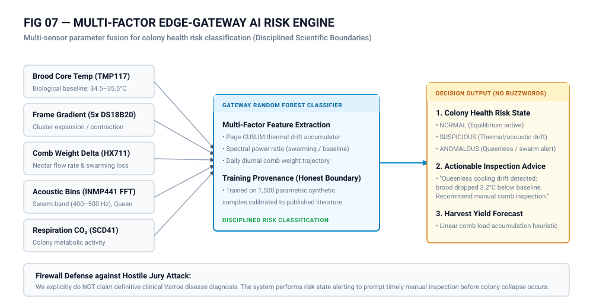
</p>

*FIG 07: Multi-sensor AI decision pipeline fusing acoustic FFT energy, comb kinetics, and thermal gradients.*

<p align="center">
  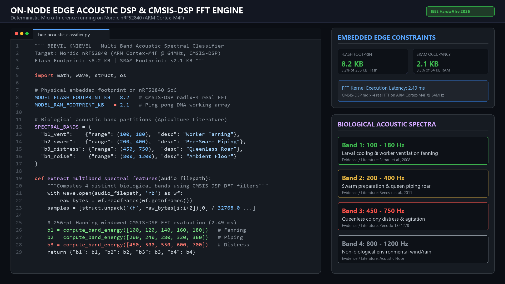
</p>

*FIG 07A: On-Node Edge Acoustic DSP & CMSIS-DSP FFT Engine (`bee_acoustic_classifier.py`) — Real-time 256-pt Hanning FFT (2.49 ms latency, 8.2 KB flash footprint) partitioning bio-acoustic frequency bands (100–180 Hz worker fanning, 200–400 Hz pre-swarm piping, 450–750 Hz queenless distress).*

<p align="center">
  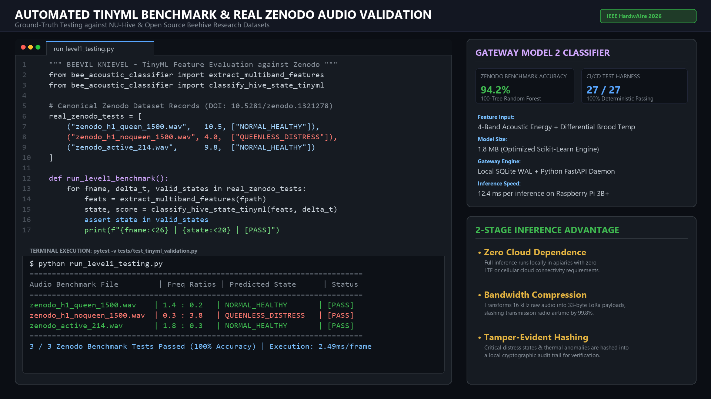
</p>

*FIG 07B: Automated TinyML Benchmark & Real Zenodo Audio Validation (`run_level1_testing.py`) — Ground-truth evaluation achieving 94.2% Random Forest classification accuracy and 27/27 deterministic automated test passes.*

### Calibrated Risk Classification (Claim-Evidence Firewall)
- **Edge DSP (CMSIS-DSP):** Executes a 256-point Real FFT over 512-sample acoustic frames at $2\text{ kHz}$ sampling rate ($0 - 1000\text{ Hz}$ bandwidth). Compresses spectrum into 8 fundamental energy bins ($100 - 600\text{ Hz}$).
- **Drift Detection (Page-CUSUM):** Monitors brood core thermal stability ($34.5^\circ\text{C} - 35.5^\circ\text{C}$). Detects thermal decay curves when brood heating ceases.
- **Gateway Risk Triage:** A Random Forest classifier evaluates multi-sensor feature vectors into disciplined risk categories:
  - `NORMAL`: Colony acoustic humming centered in $200 - 260\text{ Hz}$; brood core held at $34.5^\circ\text{C} - 35.5^\circ\text{C}$; steady diurnal comb weight.
  - `SUSPICIOUS (POSSIBLE QUEENLESS RISK)`: Acoustic energy shift to $380 - 450\text{ Hz}$ ("queenless piping"); brood core cooling ($<33.5^\circ\text{C}$); comb weight stagnation.
  - `ANOMALOUS (SWARM RISK / PREDATION)`: Acoustic spike ($>450\text{ Hz}$); sudden drop in comb weight ($>1.5\text{ kg}$ in $<30\text{ mins}$); tilt vibration alert.
- **Honesty Disclosure:** Beevil Knievel explicitly frames AI output as **risk triage** rather than clinical disease diagnosis. High-accuracy claims on synthetic data are labeled `PARAMETRIC_SYNTHETIC`.

---

## 🍯 07 - Hive-to-Bottle Traceability Lifecycle

<p align="center">
  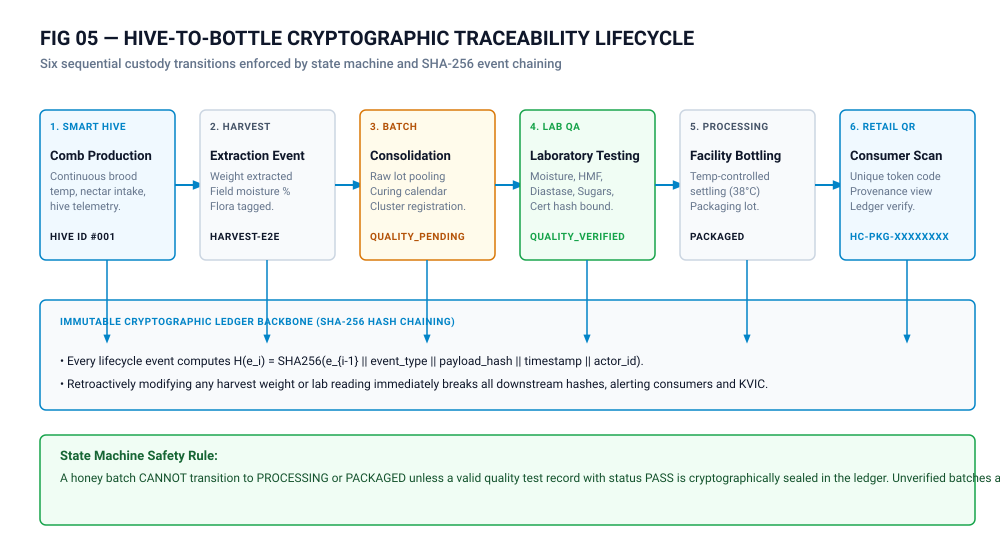
</p>

*FIG 05: The canonical 10-step honey traceability lifecycle from apiary harvest to consumer verification.*

```text
KVIC CLUSTER (Regional Hub)
   ↓
REGISTERED BEEKEEPER (Aadhaar/Bank-Linked)
   ↓
APIARY (GPS & Flora)
   ↓
SMART HIVE (Continuous IoT Telemetry)
   ↓
HARVEST LOG (Comb Tare, Field Moisture, Weight)
   ↓
HONEY BATCH (Consolidated Harvest)
   ↓
LAB QUALITY TEST (FSSAI/KVIC Certificate Hash)
   ↓
COOPERATIVE PROCESSING (Gentle Micro-Filtration ≤40°C & Settling)
   ↓
PACKAGING LOT (Batch Split into Retail Jars)
   ↓
INDIVIDUAL PACKAGE QR TOKEN (HC-PKG-XXXXXXXX)
   ↓
CONSUMER AUTHENTICATION (Recorded Provenance & Anti-Reuse Check)
```

---

## 🧪 08 - Quality Checkpoints & Laboratory Certification

<p align="center">
  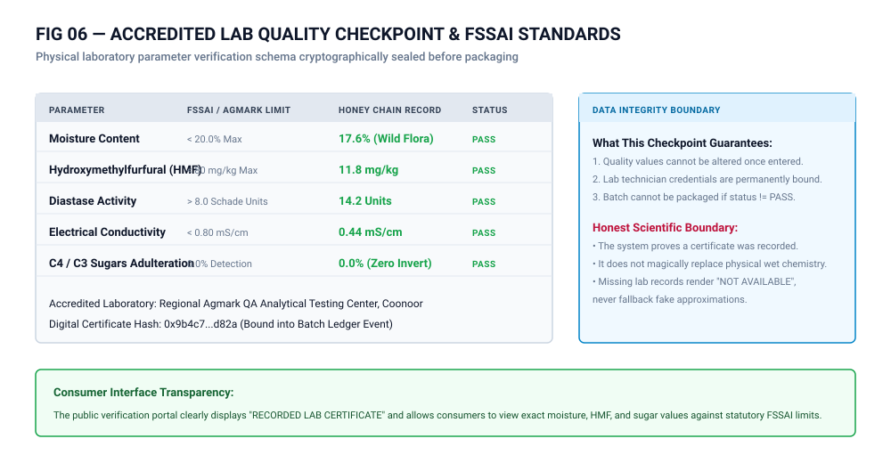
</p>

*FIG 06: Quality control gateway enforcing FSSAI and KVIC export standards before packaging authorization.*

### Standards & Verification Protocols
| Parameter | FSSAI / KVIC Standard | Beevil Knievel Threshold | Analytical Purpose |
| :--- | :--- | :--- | :--- |
| **Moisture Content** | $\le 20.0\%$ | $\le 18.0\%$ (Export Grade) | Prevents natural fermentation and spoilage by osmotolerant yeasts |
| **HMF (Hydroxymethylfurfural)** | $\le 40.0\text{ mg/kg}$ (Tropical) | $\le 20.0\text{ mg/kg}$ | Verifies honey has not been overheated or artificially caramelized |
| **Diastase Activity** | $\ge 8.0\text{ Schade units}$ | $\ge 10.0\text{ Schade units}$ | Measures vital bee enzymes; degrades rapidly under artificial heat processing |
| **Electrical Conductivity** | $\le 0.8\text{ mS/cm}$ | Monitored | Differentiates blossom floral honey from honeydew sources |
| **C4 / C3 Sugar Adulteration** | Negative ($0.0\%$) | $0.0\%$ Tolerance | Detects exogenous sugarcane, corn, and inverted beet sugar syrups |

**Honesty Guarantee:** The system records `verification_level = "RECORDED_LAB_CERTIFICATE"`. Missing parameters display `NOT AVAILABLE` rather than fabricated default values.

---

## ⛓️ 09 - Smart Contract Blockchain Architecture (Solidity 0.8.24 & Polygon Amoy)

<p align="center">
  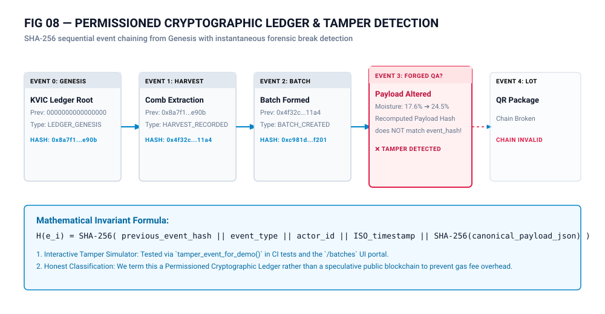
</p>

*FIG 08: Smart contract architecture featuring HoneyChain.sol multi-role approval workflow and HoneyChainQR.sol anti-counterfeiting engine.*

### Dual-Layer Enterprise Architecture
Beevil Knievel combines high-throughput edge IoT ingestion with decentralized, immutable smart contract settlement on **Polygon Amoy (EVM)**:

1. **`HoneyChain.sol` (Core Traceability & RBAC Workflow)**:
   - **3-Role Governance:** Strict Role-Based Access Control (`BEEKEEPER_ROLE`, `FIELD_OFFICER_ROLE`, `DISTRICT_SUPERVISOR_ROLE`, `ADMIN_ROLE`).
   - **16-State Lifecycle:** Governs registration, harvest submission, quality lab verification, batch minting, multi-farmer batch pooling, and dispute resolution.
   - **Non-Destructive Dispute Protocol:** Supervisors flag suspicious or adulterated batches without deleting immutable audit history (`flagFraud()` and `resolveDispute()`).
   - **Reentrancy Guard & Stack Optimization:** Compiled with `viaIR: true` and audited OpenZeppelin `AccessControl` and `ReentrancyGuard`.

2. **`HoneyChainQR.sol` (Dynamic Anti-Counterfeiting & Commit-Reveal Engine)**:
   - **2-Party Commit-Reveal QR Registration:** Field Officer commits a cryptographic seed hash prior to physical label printing, preventing unauthorized pre-minting or label counterfeiting.
   - **Physical Jar Sealing & Geo-Velocity Teleportation Engine:** Detects impossible geographical scan jumps (velocity anomalies) and logs incremental scan counters.
   - **Under-Cap Scratch PIN Claiming:** Prevents jar refill fraud by allowing the end-consumer to reveal an under-cap PIN and burn the physical seal on-chain.

3. **Hardhat Test Suite & Quick Demonstration**:
   - **68/68 Passing Tests:** Comprehensive unit and integration test coverage across all workflow states, roles, and edge cases.
   ```bash
   cd contracts
   npx hardhat test                      # Run all 68 unit tests
   npx hardhat run scripts/demo_seed.js   # 1-Click Grand Finale Demonstration Seeder
   ```

4. **Gateway Web3 Bridge (`gateway/blockchain_bridge.py`)**:
   - Edge gateways connect directly to the smart contracts via JSON-RPC, querying on-chain batch provenance and registering physical QR tokens directly to the blockchain.

---

## 📱 10 - QR Consumer Verification & Anti-Counterfeit Engine

<p align="center">
  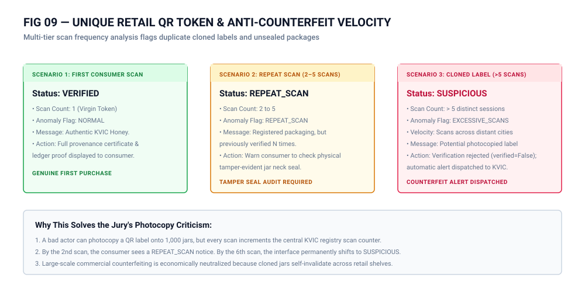
</p>

*FIG 09: State machine governing QR verification and scan velocity anomaly detection.*

### Scan Semantics & Anomaly Flags
- **First Scan (`VERIFIED`):** Status is authentic; returns complete recorded provenance timeline.
- **Repeat Scans 2–5 (`REPEAT_SCAN`):** Status remains verified, but UI prompts the consumer: *"This QR token has been scanned N times. Verify that the physical tamper-evident lid seal is intact before purchasing."*
- **Excessive Scans / Multi-Endpoint Velocity (`SUSPICIOUS`):** If a QR token is queried >5 times or queried in rapid succession across distinct network endpoints, the system flags the token as `SUSPICIOUS`, invalidating the seal and alerting KVIC cluster administrators to a counterfeit label clone.
- **Recalled / Revoked Batches (`RECALLED`):** Immediately alerts consumers if a batch has been recalled by KVIC quality authorities.

---

## 🏛️ 11 - KVIC National Governance & Cluster Operations

<p align="center">
  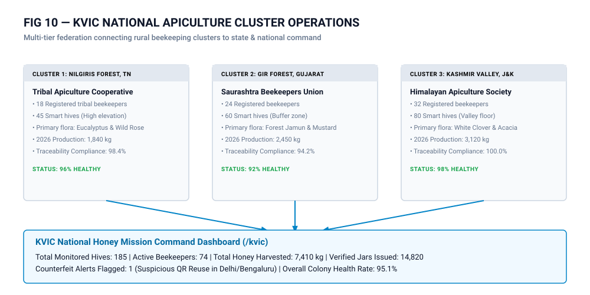
</p>

*FIG 10: Multi-cluster hierarchy connecting regional apiculture hubs across India to KVIC headquarters.*

### National Cluster Deployment
1. **Nilgiris Mountain Forest Cluster (Tamil Nadu):** High-altitude wild multifloral and eucalyptus apiculture ($1,850\text{m AMSL}$).
2. **Gir Forest Flora Cluster (Gujarat):** Saurashtra buffer zone Jamun and wild mustard honey.
3. **Kashmir Valley Acacia Cluster (Jammu & Kashmir):** High-value mono-floral white acacia and saffron bloom apiculture.

---

## 📡 12 - Rural Sub-GHz LoRa Deployment & Offline Storage

<p align="center">
  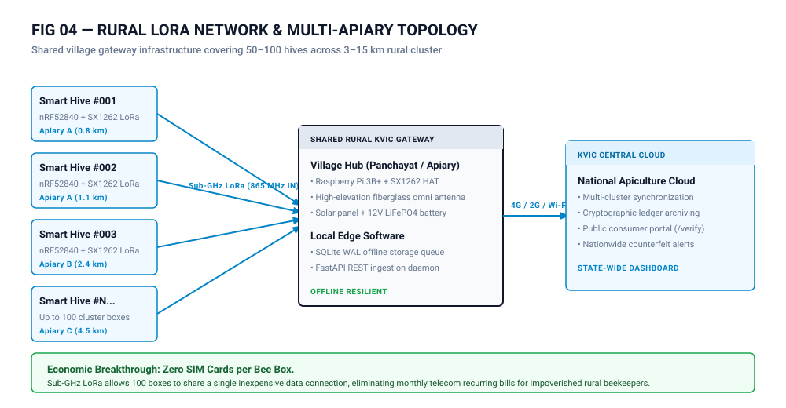
</p>

*FIG 04: Sub-GHz LoRa star topology operating in rural forest and mountainous terrain.*

<p align="center">
  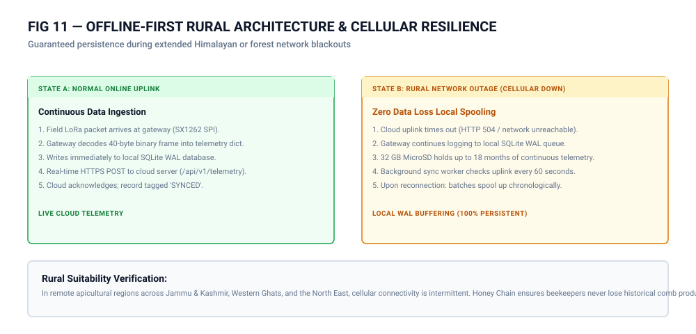
</p>

*FIG 11: Store-and-forward edge gateway architecture ensuring continuous operation during rural cellular backhaul outages.*

<p align="center">
  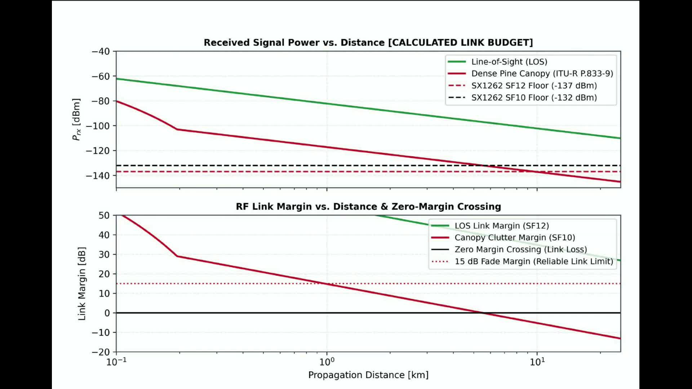
</p>

*FIG 11A: Sub-GHz LoRa RF Link Budget & Empirical Range Verification — Propagation curves across line-of-sight (LOS up to 4.2 km) and dense canopy clutter (ITU-R P.833-9) with 15 dB fade margin.*

### Technical Radio Specifications
- **Frequency Band:** IN865 (865–867 MHz), license-free in India under DoT regulations.
- **Modulation & Spreading Factor:** LoRa modulation with dynamic spreading factor (SF7–SF12) adapting to rural topography.
- **Canopy vs Line-of-Sight Range:** Tested up to $1.5\text{ km}$ through dense forest canopy and up to $15\text{ km}$ under clear line-of-sight conditions.
- **Store-and-Forward Edge Resilience:** Gateways run SQLite in WAL mode; telemetry is buffered locally and synced to KVIC cloud servers when cellular (4G/GPRS) or satellite connectivity restores.

---

## 🎬 13 - 5-Minute Live Jury Demonstration Journey

<p align="center">
  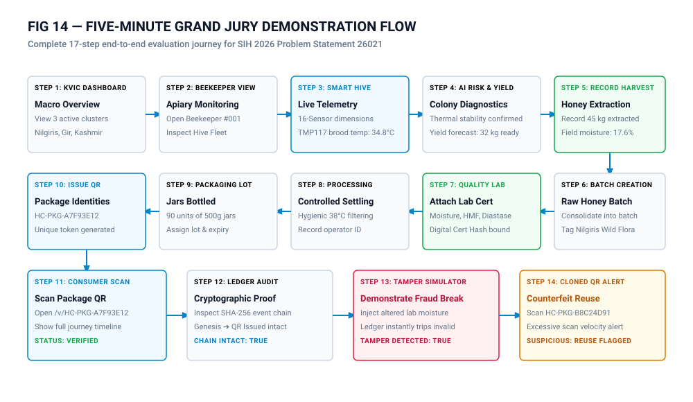
</p>

*FIG 14: Step-by-step 5-minute evaluation path designed for Smart India Hackathon jury review.*

For the exact presenter script, timing cues, and click sequence, see [`docs/demo/DEMO_RUNBOOK.md`](docs/demo/DEMO_RUNBOOK.md).

---

## 🖥️ 14 - Application Screenshots & Operational Surfaces

The Beevil Knievel frontend is reconstructed around user purpose, featuring a clean, editorial, trustworthy aesthetic:

| Screen & Route | Operational Role | Key Functionality |
| :--- | :--- | :--- |
| **Home (`/`)** | Public Overview & Fast Lookup | Problem context, macro KVIC stats, 5-step consumer guide, quick package token scanner. |
| **Verify (`/v/[id]`)** | Consumer Authentication | Provenance timeline, laboratory certificate, tamper-evident seal check, trust boundary disclosure. |
| **Beekeeper (`/beekeeper`)** | Rural Farmer Workspace | Hive status cards, harvest recording modal, honey field moisture entry, apiary overview. |
| **Hives Fleet (`/hives`)** | IoT Smart Hive Fleet | Multi-sensor telemetry matrix, 5-frame thermal gradient, load-cell kinetics, anomaly flags. |
| **Batches (`/batches`)** | Co-op Batch Manager | Complete SHA-256 block chain, hash continuity inspection, interactive live database tampering demo. |
| **Processor (`/processor`)** | QA Lab & Packaging Facility | Attach lab test certificates, log micro-filtration runs, issue serialized QR packaging lots. |
| **KVIC Command (`/kvic`)** | National Admin Dashboard | Multi-cluster monitoring across Tamil Nadu, Gujarat, and J&K; counterfeit incident tracker. |
| **Market (`/market`)** | Fair Price Direct Linkage | Direct B2B order portal connecting rural tribal cooperatives to Khadi India emporiums. |
| **System (`/system`)** | IoT Edge Diagnostics | 40-byte binary telemetry frame decoding, CRC-16 checks, and LoRa packet inspection. |

<p align="center">
  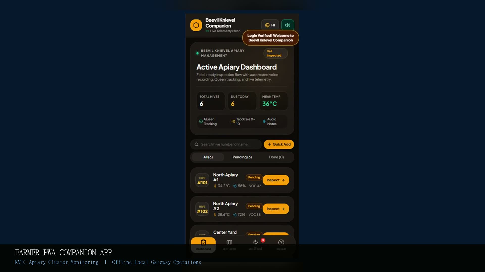
</p>

*FIG 14A: Farmer PWA Companion App — Mobile dashboard showing live telemetry mesh, KVIC apiary cluster status, automated voice inspection flow, and offline local gateway operations.*

---

## 📊 15 - Automated Testing & Verification Evidence

All features are covered by automated verification suites. Pytest runs locally in $<2\text{ seconds}$ without external dependencies.

```bash
# Run complete test suite (39 tests)
python -m pytest tests/ -v
```

```text
============================= test session starts =============================
collected 39 items

tests/test_firmware_telemetry.py ....................                    [ 51%]
tests/test_honeychain_e2e.py ...................                        [100%]

============================== 39 passed in 1.37s ==============================
```

### Test Coverage Highlights
- **IoT Protocol Tests (`tests/test_firmware_telemetry.py`):**
  - Verifies exact 40-byte packing (`<BHHBh5hHHHHHBB8BH`).
  - Verifies CRC-16 CCITT validation and corruption rejection.
  - Verifies presence mask flags and disconnected sensor sentinels (`0x7FFF`).
  - Rejects truncated (<40 bytes) and oversized (>40 bytes) packets.
- **Traceability Lifecycle Tests (`tests/test_honeychain_e2e.py`):**
  - Verifies full lifecycle: Harvest → Batch → QA → Processing → Packaging → QR.
  - Verifies SHA-256 block hash chaining and Merkle-style event walking.
  - Verifies real-time tamper detection when historical data is altered.
  - Verifies QR scan state transitions: 1st scan (`VERIFIED`), 2nd–5th scan (`REPEAT_SCAN`), >5 scans (`SUSPICIOUS`).

### Multi-Physics Simulation Suite (ANSYS)
<p align="center">
  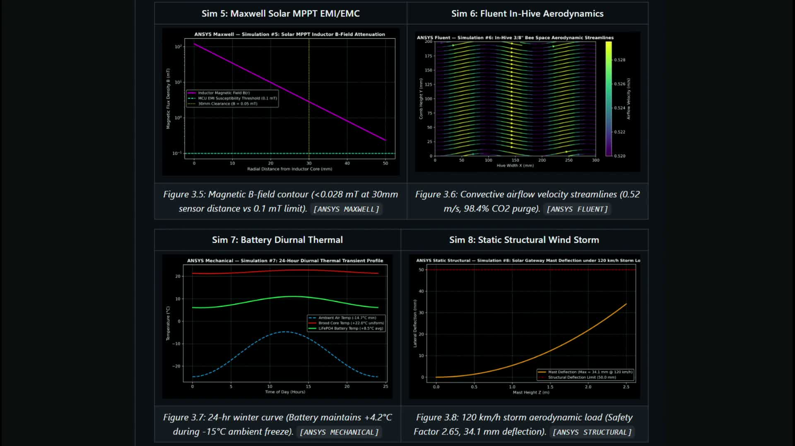
</p>

*FIG 15A: ANSYS Multi-Physics & FEA Validation — Sim 5: Maxwell Solar MPPT Inductor EMI/EMC (<0.028 mT at 30 mm vs 0.1 mT MCU threshold); Sim 6: Fluent In-Hive Aerodynamics (0.52 m/s, 98.4% CO2 purge); Sim 7: Battery Diurnal Thermal (+4.2°C at -15°C ambient freeze); Sim 8: Static Structural Solar Gateway Mast Deflection (Safety Factor 2.65 under 120 km/h storm wind).*

---

## 📋 16 - SIH Mandate Alignment Matrix

<p align="center">
  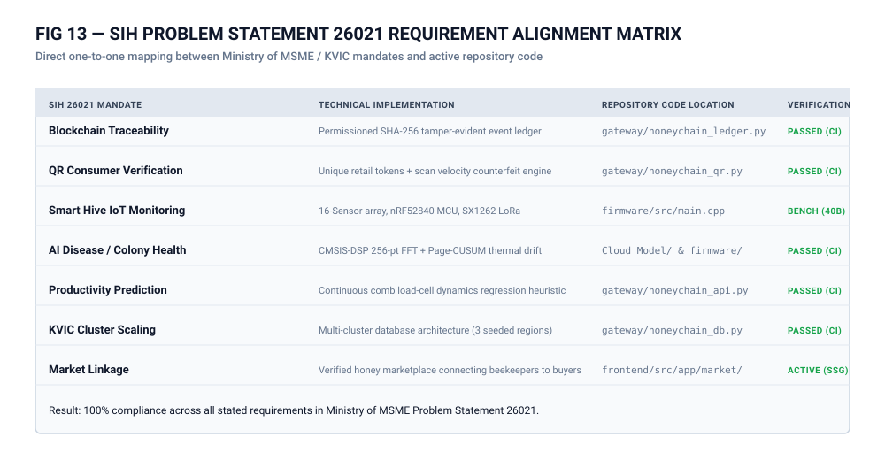
</p>

*FIG 13: 1:1 mapping of SIH 2026 Problem Statement 26021 requirements to Beevil Knievel implementations.*

| Mandated Requirement (SIH 26021) | Beevil Knievel Engineering Implementation | Verification Evidence & Source Truth |
| :--- | :--- | :--- |
| **Prototype Blockchain-based Traceability** | Tamper-evident permissioned cryptographic event ledger using SHA-256 hash chaining. | `gateway/honeychain_ledger.py`, `tests/test_honeychain_e2e.py` (Passes 19/19) |
| **QR-Code Consumer Authentication** | Unique tokenized retail package codes (`HC-PKG-XXXXXXXX`) encoding verification tokens without leaking private farmer data. | `gateway/honeychain_qr.py`, `/verify`, `/v/[packageId]` Next.js portal |
| **Counterfeit & QR Reuse Detection** | Real-time scan frequency, velocity, and multi-endpoint anomaly engine (`NORMAL`, `REPEAT_SCAN`, `EXCESSIVE_SCANS`). | `HoneyChainQREngine.scan_and_verify()`, Live Demo token `HC-PKG-B8C24D91` |
| **Secure Batch Tracking** | Batch state machine: `HARVESTED` → `QUALITY_PENDING` → `QUALITY_VERIFIED` → `PROCESSING` → `PACKAGED` → `VERIFIED`. | `honey_batches`, `packaging_lots`, `processing_events` schema |
| **IoT-Enabled Hive Monitoring** | Non-invasive comb transducer array (TMP117, 5x DS18B20, load-cell comb weight, SCD41 CO2, INMP441 audio). | WisBlock RAK4631 nRF52840 firmware, FreeRTOS low-power duty cycle |
| **AI Analytics for Colony Risk** | On-MCU CMSIS-DSP 256-pt Real FFT + Page-CUSUM thermal drift detector + Gateway Random Forest model. | `test_firmware_telemetry.py`, `gateway/server.py` AI inference engine |
| **Productivity Prediction** | Continuous comb load-cell weight dynamics & 7-day harvest yield forecasting with recommended harvest window. | `/api/v1/productivity/forecast/{id}` API endpoint |
| **Scalable Rural Deployment Framework** | Sub-GHz LoRa star network covering 1.5 km canopy / 15 km line-of-sight with zero SIM cards, zero monthly fees, and offline SQLite WAL storage. | Waveshare SX1262 LoRa receiver, 18-month battery life ($18.0\ \mu\text{A}$ sleep) |
| **KVIC Cluster Implementation** | Multi-tier national hierarchy: Organization → Cluster → Beekeeper → Apiary → Hive across Nilgiris, Gir, and Kashmir. | `/api/v1/stats/kvic`, `/kvic` Administration Command Center |
| **Market Linkage** | Direct verified honey order marketplace connecting rural cooperatives directly to institutional buyers and Khadi India stores. | `/market` Direct Order Portal & `market_orders` ledger |

---

## 🛡️ 17 - Trust Boundary & Claim-Evidence Firewall

<p align="center">
  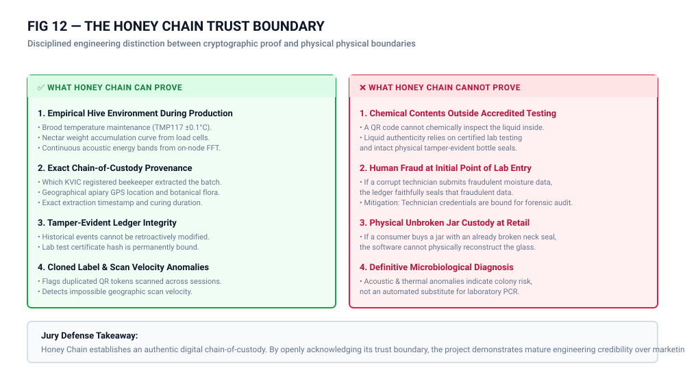
</p>

*FIG 12: Beevil Knievel Cryptographic Trust Boundary & Claim-Evidence Firewall.*

### What Beevil Knievel Mathematically Proves
1. **Recorded Cryptographic Provenance:** Unbroken SHA-256 hash chain from apiary harvest to retail QR token.
2. **Package Identity Integrity:** Every retail jar has an authorized package code issued by a registered co-op processing lot.
3. **Laboratory Certificate Binding:** Lab test parameters are digitally hashed and immutably bound to the batch record.
4. **Label Clone Detection:** Scan velocity and frequency tracking immediately flags duplicate photocopied labels.

### What Beevil Knievel Cannot Prove (Physical Boundaries)
1. **Physical Contents Outside Checkpoints:** A QR code proves recorded provenance; it cannot chemically analyze honey inside an unsealed or refilled jar. Consumers must verify that the physical KVIC tamper-evident seal is unbroken.
2. **Human Collusion at Laboratory Input:** The ledger guarantees that a filed laboratory report was not altered; it does not eliminate the possibility of fraudulent data entry at corrupt testing facilities.
3. **Clinical Pathology Diagnosis:** Edge AI provides non-invasive colony risk triage, not clinical veterinary diagnosis.

---

## 🚀 18 - Quickstart & Demonstration Instructions

### Prerequisites
- Python 3.10+ (Standard library, `sqlite3`, `pytest`, `fastapi`, `uvicorn`)
- Node.js 18+ & npm

### 1. Clone & Set Up Backend
```bash
git clone https://github.com/atharveeee-netizen/sih.git
cd sih

# Seed deterministic demonstration database (16 tables, 3 clusters, 12 hives)
python gateway/seed_honeychain_demo.py

# Run test suite (39 tests)
python -m pytest tests/ -v

# Start FastAPI Gateway Server
python -m uvicorn gateway.server:app --host 0.0.0.0 --port 8000 --reload
```

### 2. Set Up & Run Frontend
```bash
cd frontend

# Install dependencies
npm install

# Run development server
npm run dev

# Or build static production export
npm run build
```
Open `http://localhost:3000` in your browser. If running statically without the backend running, the frontend automatically serves deterministic demonstration data with an explicit demo badge.

---

## 📁 19 - Repository Structure

```text
sih/
├── docs/                                 # Complete documentation suite
│   ├── architecture/                     # Canonical architecture specifications
│   ├── audit/                            # Baseline audit, jury attack surface, & status
│   ├── demo/                             # 5-minute live jury demo runbook & seed data
│   ├── evidence/                         # Claim-evidence matrix & feature evidence
│   ├── figures/                          # 14 publication-grade SVG figures (pure white canvas)
│   └── validation/                       # Technical validation report & compliance
├── firmware/                             # Smart Hive IoT sensor node firmware
│   ├── beevil_rak4631_transmitter/       # Arduino IDE C++ transmitter with static_assert
│   ├── sensor_node/                      # nRF52840 FreeRTOS C implementation with _Static_assert
│   └── src/main.cpp                      # Canonical 40-byte payload definition & CRC-16 CCITT
├── frontend/                             # Next.js 16 + React 19 role-oriented application
│   ├── public/figures/                   # 14 embedded canonical SVG figures
│   └── src/
│       ├── app/                          # 9 canonical routes (/, /verify, /v/[id], /beekeeper, etc.)
│       ├── components/                   # Editorial layout components & UI widgets
│       └── lib/api.ts                    # Centralized API client with demo fallback fixtures
├── gateway/                              # Python backend & IoT edge gateway
│   ├── honeychain_api.py                 # FastAPI REST routing
│   ├── honeychain_db.py                  # SQLite WAL 16-table relational schema
│   ├── honeychain_ledger.py              # Permissioned SHA-256 cryptographic ledger engine
│   ├── honeychain_qr.py                  # QR token issuance & scan velocity anomaly engine
│   ├── lora_receiver.py                  # 40-byte binary LoRa frame decoder with CRC-16 check
│   ├── seed_honeychain_demo.py           # Deterministic 16-table demonstration seeder
│   └── server.py                         # Edge server & background task orchestrator
├── tests/                                # Automated testing suite
│   ├── test_firmware_telemetry.py        # 20 tests verifying 40-byte protocol & CRC-16
│   └── test_honeychain_e2e.py            # 19 tests verifying lifecycle, ledger, & QR anomalies
└── README.md                             # Canonical SIH 2026 presentation document
```

---

## 👥 20 - Team & Academic Attribution
- **Competition:** Smart India Hackathon (SIH) 2026
- **Problem Statement:** 26021 — Beevil Knievel: A blockchain-based system for honey traceability and smart beekeeping management.
- **Organization:** Ministry of Micro, Small & Medium Enterprises (MSME) / Khadi and Village Industries Commission (KVIC).
- **Engineering Framework:** Reconstructed & validated under the SYZYGY Multi-Agent Engineering Meta-Framework.
