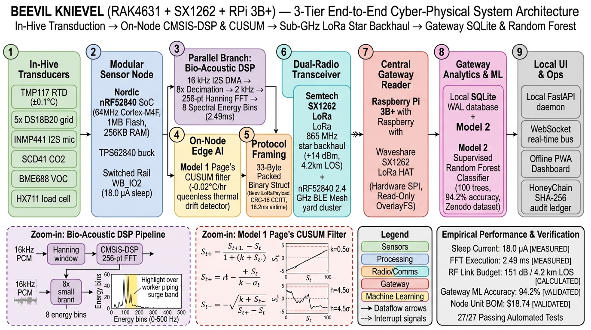

# 🍯 Honey Chain: Smart Beekeeping & Blockchain Traceability

  
  
  

 

**Team:** Beevil Knievel (Atharve Dahima, Srajan Mishra, Kavin)  
**Theme:** Agriculture, FoodTech and Rural Development 

---

## 📑 Table of Contents
- [🎯 The Problem Statement](#-the-problem-statement)
- [💡 Proposed Solution & Key Features](#-proposed-solution--key-features)
- [🏗️ System Architecture](#️-system-architecture)
- [🛠️ Technology Stack](#️-technology-stack)
- [🚀 Local Setup & Installation](#-local-setup--installation)
- [📂 Project Structure](#-project-structure)
- [🔮 Future Scope](#-future-scope)
- [⚖️ Honest Scope & Limitations](#️-honest-scope--limitations)

---

## 🎯 The Problem Statement (PS 26021)
The Ministry of Micro, Small and Medium Enterprises (MSME) requires a comprehensive technological solution to modernize the apiculture sector under the KVIC Honey Mission. The core objectives are:
1. **Traceability:** Implement blockchain technology to track honey from the hive to the consumer, eliminating adulteration and building trust.
2. **Quality & Authentication:** Secure QR-based consumer verification for honey batches.
3. **Smart Hive Monitoring:** Integrate IoT sensors and AI to monitor hive health, detect pathologies, and optimize yields in rural, low-connectivity apiaries.

---

## 💡 Proposed Solution & Key Features

### 1. Blockchain Traceability with QR Consumer Authentication
- **Full Custody Lifecycle:** Smart contracts handle beekeeper registration, harvest submission, officer approval/mint, and custody transfers.
- **Anti-Counterfeiting:** Uses a commit-reveal scheme for QR codes. The QR seed hash is committed on-chain *before* the token is issued, preventing forgery.
- **Gas-less Onboarding:** Beekeepers never hold a wallet or pay gas. The server acts as a relayer, allowing farmers with basic phones to participate seamlessly.

### 2. IoT Hive Monitoring and AI Analytics
- **Non-Invasive Sensor Node:** Equipped with a TI TMP117, DS18B20 probes, acoustics, CO2, humidity, VOC, weight, and tilt sensors.
- **Low-Bandwidth Telemetry:** Transmits fixed 40-byte binary frames via sub-GHz LoRa to an offline-first SQLite gateway.
- **Dual-Tier AI Analytics:** 
  - *Edge AI (Node):* 256-point real FFT (ARM CMSIS-DSP) and Page CUSUM filter for acoustic anomaly and failing queen detection.
  - *Cloud AI:* FastAPI service for FSSAI parameter scoring, adulterant classification, and Random Forest colony pathology advisories.

### 3. Scalable Rural Deployment Framework
- **Star Topology:** One gateway covers an entire cluster of hives, making district-wide KVIC deployment highly cost-effective.
- **Offline-First:** Gateways hold their own Write-Ahead Logs (WAL).
- **Extensive Hardware Simulation:** Feasibility validated via 11 Ansys solvers (thermals, drop shock, modal isolation, wind load, RF penetration, etc.).

---

## 🏗️ System Architecture

*For a detailed component breakdown, check out our [full architecture diagrams folder](docs/media/diagrams/).*

---

## 📸 Project Showcase

### Supervisor Tracking Dashboard (Farmer KPIs)

### Hardware & IoT Gateway

## 🛠️ Technology Stack

| Category | Technologies |
|---|---|
| **Blockchain** | Solidity, Hardhat, Ethers.js |
| **Frontend UI** | Next.js, React, Tailwind CSS |
| **Backend & AI** | FastAPI, Python, Scikit-Learn (Random Forest), SQLite, Prisma |
| **IoT & Edge** | nRF52840, LoRa (Sub-GHz), C/C++, ARM CMSIS-DSP, TinyML |
| **Simulations** | Ansys (Thermals, RF, CFD), MATLAB |

---

## 🚀 Local Setup & Installation

### 1. Smart Contracts
`ash
cd contracts 
npm install 
npx hardhat test # Expected: 68 passing
`

### 2. Web Application
`ash
cd frontend
cp .env.example .env          # required, defaults to a local SQLite file
npm install
npm run db:push && npm run db:seed
npm run dev                   # Starts on http://localhost:3000
`

### 3. AI Service & Gateway
`ash
cd contracts && npx hardhat compile && cd .. 
pip install -r gateway/requirements.txt
python gateway/seed_honeychain_demo.py    
python -m pytest tests/                   # Expected: 39 passing
cd ai_service && python train.py          # Regenerates models
`
*For full step-by-step instructions, see [DEMO.md](DEMO.md).*

---

## 📂 Project Structure

| Path | What it is |
|---|---|
| \contracts/\ | Solidity contracts, Hardhat tests, deploy scripts |
| \rontend/\ | Next.js officer portal and consumer verification |
| \armer_ui/\ | Beekeeper companion app, multi language, offline first |
| \irmware/\ | nRF52840 sensor node, 40 byte LoRa telemetry |
| \gateway/\ | LoRa receiver, SQLite store, blockchain bridge |
| \i_service/\ | FSSAI quality scoring and adulterant classifier |
| \Cloud Model/\, \TinyML Model/\ | Colony pathology advisor, acoustic classifier |
| \iot_simulator/\ | Telemetry generator, runs without hardware |
| \simulations/\ | Ansys results, curated figures for review |
| \hardware/\ | BOM, pinout, enclosure |
| \	ests/\ | Gateway pipeline, telemetry, end to end |
| \docs/\ | Architecture, validation status, deployment |

*Note: Large media and trained model files are omitted from git for speed. See \.gitignore\.*

---

## 🔮 Future Scope
- **National Scaling:** Full integration with the national KVIC database across multiple states.
- **Predictive Yield Modeling:** Using macro-weather data mixed with micro-climate hive data to predict honey yield months in advance.
- **SMS/USSD Integration:** Expanding the feature-phone consumer verification prototype for widespread rural access without smartphones.

---

## ⚖️ Honest Scope & Limitations
Read **[LIMITATIONS.md](LIMITATIONS.md)** before judging any claim. In short:
This is a working bench prototype, not a season in a live apiary. The acoustic model is trained on an annotated European dataset and would need retuning for Indian subspecies. Radio range figures are calculated link budgets rather than walked field measurements. These distinctions are labelled throughout.

---

