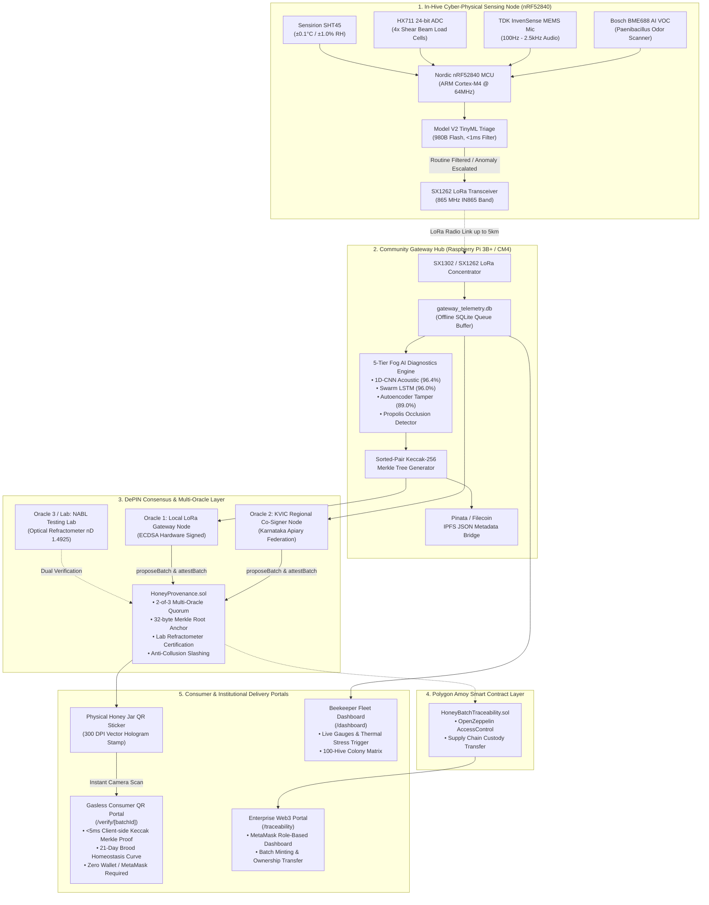
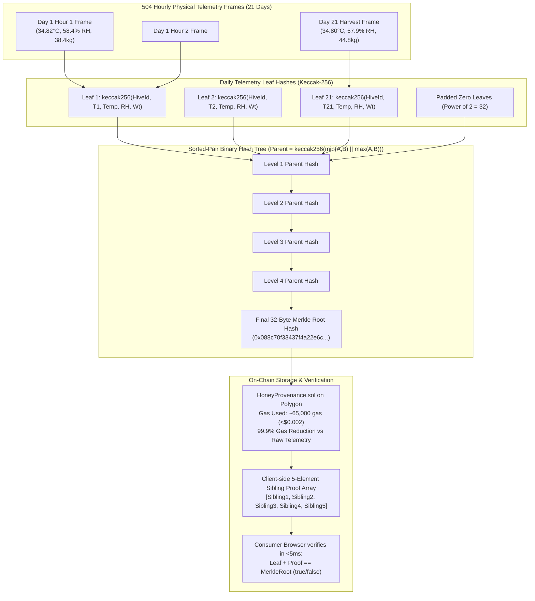
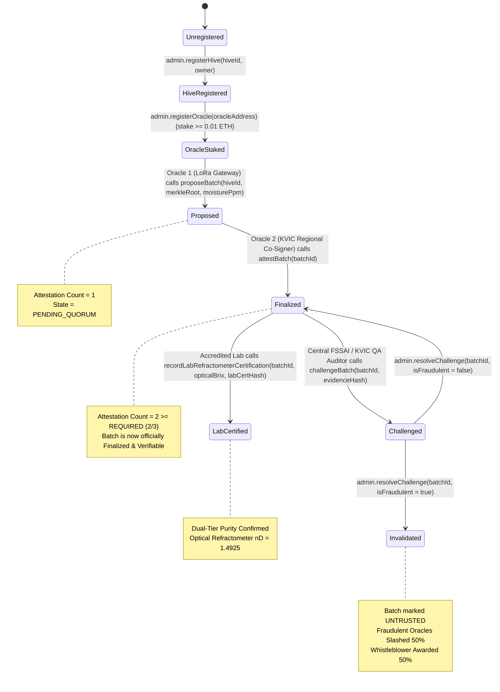
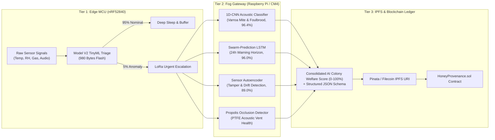
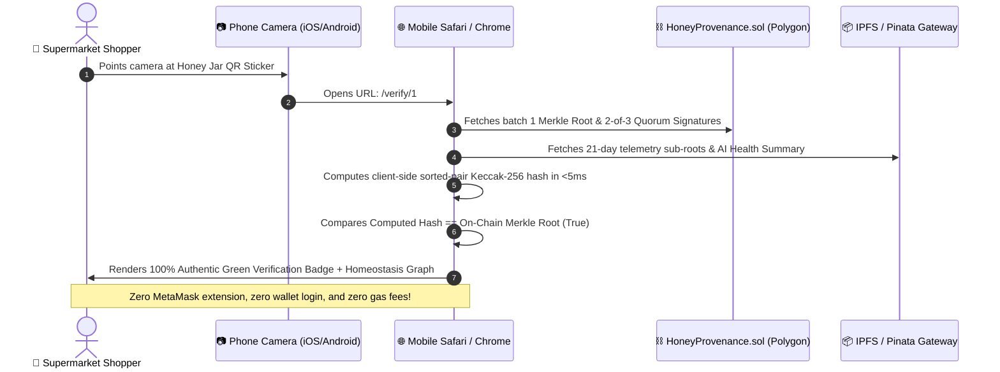

# 🏛️ HoneyChain: Complete Architecture Diagrams & Flowchart Suite
### **Problem Statement**: `SIH26021` — *Ministry of MSME, Coordination Section*
**Theme**: Smart Automation | **Team**: Beevil Knievel

---

## 1. 🌐 Master End-to-End Cyber-Physical System Architecture



---

## 2. 🌳 Sorted-Pair Keccak-256 Merkle Provenance Compression Flowchart



---

## 3. ⚖️ 2-of-3 Multi-Oracle Quorum & Anti-Collusion Slashing State Machine



---

## 4. 🧠 5-Tier Hierarchical AI Diagnostic Pipeline



---

## 5. 📱 Gasless Consumer QR Verification Sequence Diagram



---

## 6. 🌾 KVIC Rural Cooperative Cluster Deployment Topology

```mermaid
graph TD
    subgraph CLUSTER["KVIC Rural Cooperative Cluster (Coorg / Western Ghats)"]
        H1["Hive #001<br/>(Node 1)"]
        H2["Hive #002<br/>(Node 2)"]
        H3["Hive #003<br/>(Node 3)"]
        H20["Hive #020<br/>(Node 20)"]
        
        GW["Shared Community LoRa Hub<br/>(Raspberry Pi 3B+ / CM4 + 5W Solar)<br/>Ratio: 1 Gateway per 20 Hives"]
        
        H1 & H2 & H3 & H20 -.->|LoRa Multi-Hop Mesh (up to 5 km)| GW
    end

    subgraph SOFTWARE["Software-Only Onboarding Tier (Free for Smallholders)"]
        FARMER["Smallholder Farmer<br/>(Zero Hardware Cost)"]
        OFFICER["KVIC Field Officer"]
        APP["KVIC Rural Onboard Portal (/kvic-onboard)<br/>• Photo Frame Inspection<br/>• Manual Moisture Refractometer Entry"]
        
        FARMER --> OFFICER
        OFFICER --> APP
        APP --> GW
    end

    subgraph CLOUD["National Federation Ledger"]
        POLYGON["Polygon POS Network"]
        KVIC_DASH["National KVIC Fleet Command Center"]
        FSSAI_AUDIT["FSSAI Export Audit Portal (/inspector)"]
        
        GW -->|4G LTE / Satellite / Offline Replay| POLYGON
        POLYGON --> KVIC_DASH
        POLYGON --> FSSAI_AUDIT
    end
```
