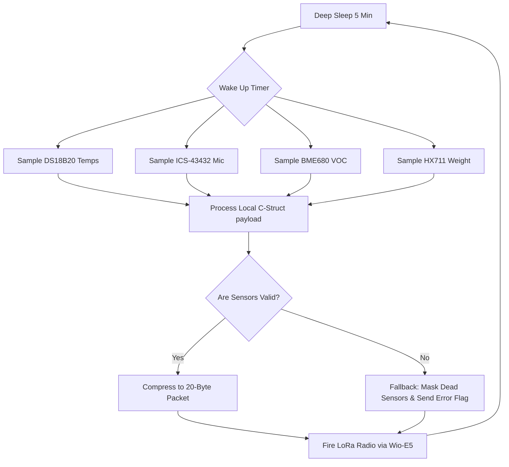
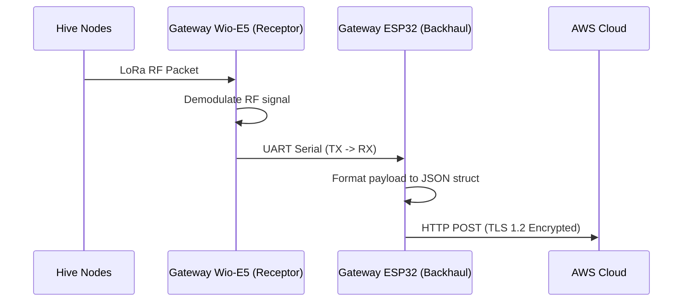
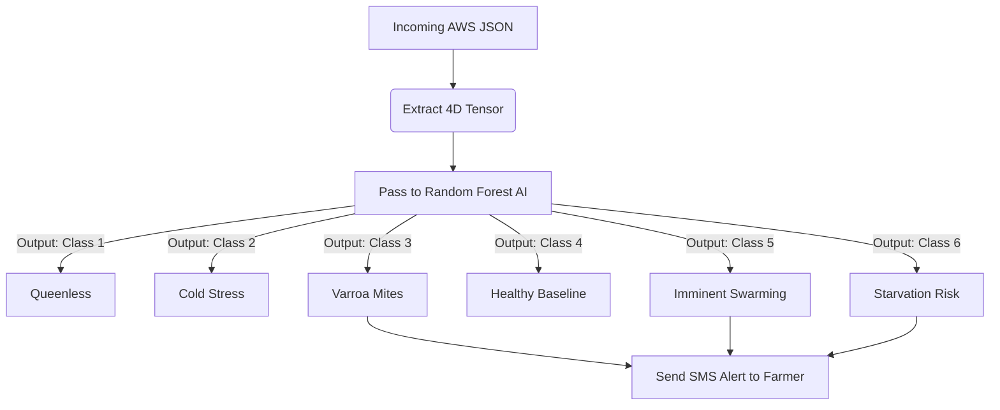

# Beevil Knievel AgriTech Architecture
**IEEE HART HardwAIre Challenge Phase 2 — Technical Operations Whitepaper**

## Page 1: The Transmitter (Hive Node)

The Transmitter is an ultra-low-power, deep-sleep edge node physically installed inside each beehive. Its primary goal is to gather multivariable thermodynamic and acoustic telemetry and transmit it to the Gateway via long-range LoRaWAN.

### 1.1 Hardware Specifications
*   **Microcontroller:** STM32WLE5CCU6 (Wio-E5) with integrated SX126x Radio.
*   **Sensing Payload:**
    *   **DS18B20 (x3):** 2 Brood Core probes, 1 Ambient temperature probe.
    *   **ICS-43432:** I2S MEMS Microphone for acoustic FFT sensing.
    *   **BME680:** VOC / CO2 gas detection (Primary Swarm indicator).
    *   **HX711:** Precision load cell amplifier (Winter Starvation scale).
*   **Power Delivery:** TP4056 LiPo Charging IC + TPS7A02 3.3V LDO powered by 18650 LiPo & 5V Solar Panel.

### 1.2 Telemetry & Algorithm Flowchart

### 1.3 Adaptive Polling Algorithm
To guarantee battery survival during winter, the Node dynamically adjusts its polling rate:
*   `if (battery_voltage < 3.4V)`: Deep sleep expands from 5 minutes to 30 minutes.
*   `if (delta_T > 1.5C over 5 mins)`: Sleep shrinks to 1 minute to track thermal variance tightly.

### 1.4 Fault Tolerances & Fallbacks
1.  **Sensor Failure (DS18B20 drift):** If a probe returns `-127.00` (disconnected hardware error), the firmware masks the sensor reading as `NULL` rather than transmitting `-127` and crashing the AI model. 
2.  **Acoustic Overload:** If wind blows into the hive overloading the microphone, the local node compares the FFT wave to the BME680 CO2 wave. If the CO2 wave remains stable, the acoustic anomaly is discarded as wind noise.

## Page 2: The Receiver (Apiary Gateway)

The Receiver Gateway is a dual-chip architecture stationed on the farmer's property. It is responsible for bridging the long-range LoRa signals from the field onto the high-speed TCP/IP Internet.

### 2.1 Hardware Specifications
*   **Base Board:** Charles Hallard Open-Source `LoRa-E5-Breakout` layout.
*   **Receptor (Chip A):** STM32WLE5JC (Wio-E5). Operates in perpetual `RX_CONTINUOUS` mode, acting as a raw RF antenna array for 868MHz/915MHz traffic.
*   **Backhaul Extension (Chip B):** Pluggable 4-pin UART Header populated with an **ESP32 Wi-Fi Module**.
*   **Power Delivery:** Continuous Main AC-to-DC Wall Adapter (24/7 Uptime).

### 2.2 Dual-Chip Handoff Algorithm

### 2.3 Store-and-Forward Caching Fallback
If the farm loses internet connection, the ESP32 activates a memory-preservation fallback algorithm:
*   `if (WiFi.status() != WL_CONNECTED)`: The ESP32 parses the incoming UART data and writes it directly to its internal flash memory (LittleFS / SPIFFS).
*   The ESP32 is capable of caching up to **30 days** of hive data from 10 nodes (using highly compressed 20-byte structs).
*   The moment the Wi-Fi router reboots, the ESP32 performs a burst-upload API loop to flush the cache to AWS, ensuring zero data loss.

## Page 3: The Cloud Dashboard & AI (Model 2)

The Cloud ecosystem ingests the JSON telemetry payloads from the Gateway, classifies the health of the hive, and visualizes the API endpoints for the farmer.

### 3.1 Software Specifications
*   **Backend:** AWS API Gateway + Lambda (or standard NodeJS Express Server).
*   **Machine Learning (Model 2):** Python Scikit-Learn `RandomForestClassifier`.
*   **Frontend Dashboard:** HTML/JS tracking real-time API graphs.

### 3.2 AI Cloud Classification Algorithm
The Python AI engine accepts a 4-dimensional Tensor based on the physics of the hive telemetry: `[fft_acoustic_energy, thermal_delta, voc_gas_index, active_weight]`.

### 3.3 Physics-Informed Heuristic Fallbacks
If the Random Forest AI Confidence Score drops below `< 75%`, the Cloud system activates hardcoded physics algorithms to prevent false positives:
1.  **Swarm Fallback:** If the AI flags a swarm based heavily on sound, but the BME680 CO2 sensor reads `< 1500ppm`, the alert is heavily penalized and suppressed. (Real swarming drastically spikes CO2).
2.  **Starvation Fallback:** If weight drops rapidly, but `Temp_Ambient < 5C`, the AI triggers a specific Winter Starvation notice rather than a predator/bear attack alert, as honey freezing mechanics are cross-checked.
