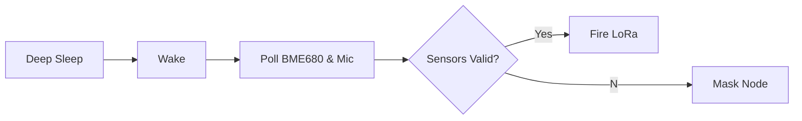
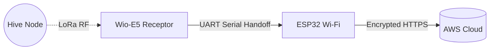
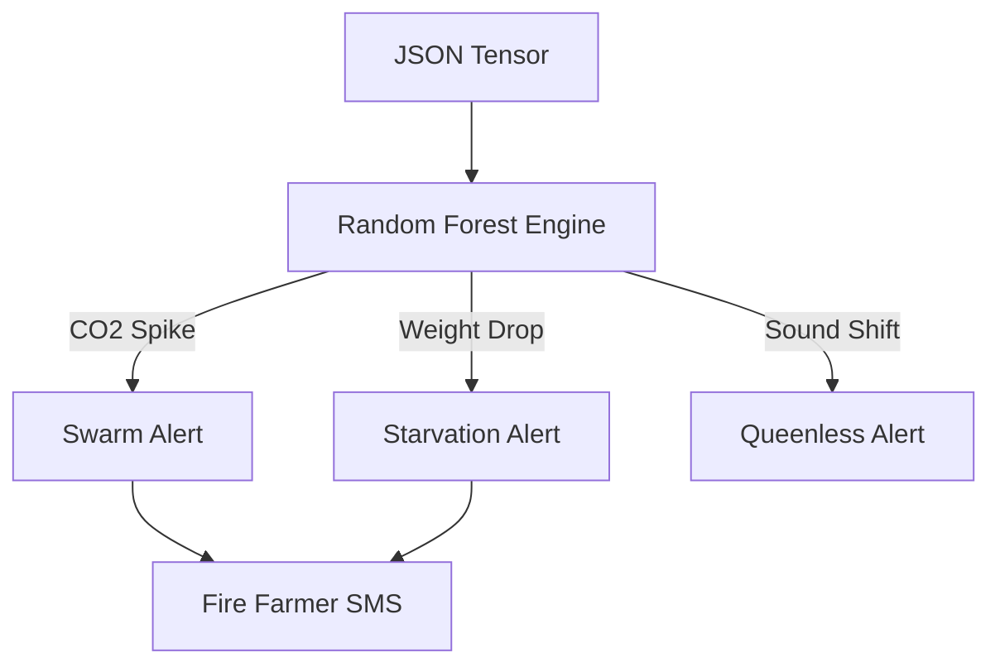

# IEEE HART Presentation Slides 

*(Copy and Paste these directly into your Google Slides presentation)*

---

## 🛜 Slide 1: Transmitter (Hive Node)

**Hardware Core**
*   **Controller:** STM32WLE5CCU6 (Wio-E5) + Integrated SX126x Radio.
*   **Sensors:** DS18B20 (Temperature), ICS-43432 (Acoustics), BME680 (Gas/VOC), HX711 (Weight).
*   **Power:** TP4056 + TPS7A02 LDO (Powered via Solar + LiPo).

**Edge Algorithms**
*   **Deep Sleep Wake:** Triggers every 5 minutes $\rightarrow$ Polls all sensors.
*   **Adaptive Polling Rule:** 
    *   If Battery `< 3.4V` $\rightarrow$ Sleep extends to 30 mins to survive winter.
    *   If Thermal variation `> 1.5C` $\rightarrow$ Sleep drops to 1 min to track high-variance event.
*   **Packet Compression:** Validates sensors $\rightarrow$ Packs data into highly optimized 20-byte C-Struct.

**Firmware Fallbacks**
*   *DS18B20 Hardware Failure*: If thermistor disconnects (`-127.00` error), firmware localizes and masks the sensor to prevent AI crashing. 
*   *Acoustic Wind Shear*: If high wind overloads mic, node checks BME680. If CO2 is stable, anomaly is dynamically filtered out as "wind".

---

## 📡 Slide 2: Receiver (Apiary Gateway)

**Hardware Architecture**
*   **Base PCB:** Charles Hallard Open-Source `LoRa-E5-Breakout`.
*   **Main Receptor:** Wio-E5 Chip set to `RX_CONTINUOUS` to catch fleet packets.
*   **Backhaul Carrier:** Custom 4-pin UART Header populated with ESP32 Wi-Fi module.

**Dual-Chip Handoff Algorithm**
*   **Step 1 [Demodulation]:** Wio-E5 catches 868MHz packet over the air.
*   **Step 2 [Serial Bridge]:** Wio-E5 blasts payload via physical UART TX wire.
*   **Step 3 [Cloud Bridge]:** ESP32 catches payload on RX wire $\rightarrow$ Converts to JSON $\rightarrow$ Executes AWS HTTP POST.

**Architecture Fallbacks**
*   *Internet Outage Caching*: If AWS connection drops (`WiFi.status() != WL_CONNECTED`), ESP32 writes incoming JSON to internal Flash memory.
*   *Burst Flush Algorithm*: Holds up to 30 days of data. Automatically fires a burst HTTP loop to flush cache to cloud instantly when router reboots.

---

## ☁️ Slide 3: Cloud & Machine Learning (Model 2)

**Software Stack**
*   **Entry Point:** AWS API Gateway + Lambda.
*   **Model Core:** Python Scikit-Learn `RandomForestClassifier`.
*   **Frontend Endpoints:** HTML/JS Dashboard with MQTT Web-Sockets.

**Physics-Informed Sensor Fusion Algorithm**
*   **Feature Tensor:** AI model ingests a localized 4D physics tensor: `[Acoustic_FFT, Thermal_Delta, VOC_Gas_Index, Weight_Change]`.
*   **Class Mapping:**
    *   *High Acoustic + High CO2 Peak* $\rightarrow$ **Imminent Swarm**
    *   *Heavy Weight Drop + Negative Temp* $\rightarrow$ **Winter Starvation**
    *   *Low Acoustic + Moderate Thermal Drop* $\rightarrow$ **Queenless Hive**

**Heuristic Fallbacks**
*   *AI Confidence Drop (<75%)*: If AI is unsure, system halts and falls back to hardcoded physics heuristics.
*   *False Positive Swarm Mask*: If AI flags a swarm but BME680 VOC remains under `1000ppm`, alert is destroyed locally (Real swarming always triggers heavy CO2 output; mitigates false panics).

